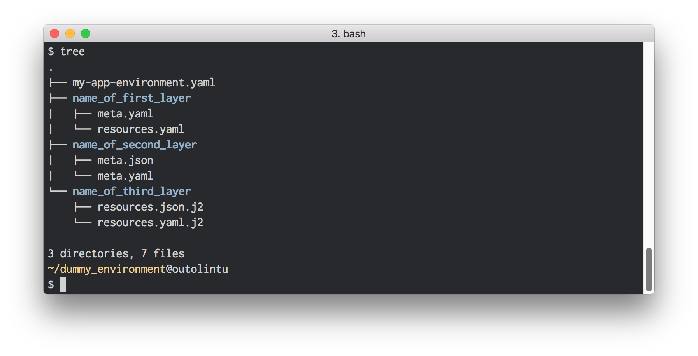

humilis
==========

[](https://circleci.com/gh/InnovativeTravel/humilis)
[](https://pypi.python.org/pypi/humilis)

Helps you deploy AWS infrastructure with [Cloudformation][cf].

[cf]: https://aws.amazon.com/cloudformation/

This project is originally based on the
[cumulus](https://github.com/germangh/cumulus/blob/master/cumulus/__init__.py).
project. See [CUMULUS_LICENSE][cumulus_license] for license information.

[cumulus]: https://github.com/cotdsa/cumulus
[cumulus_license]: https://github.com/germangh/humilis/blob/master/CUMULUS_LICENSE


# Installation

To install the latest "stable" version:

```
pip install humilis
```

To install the development version:

````
pip install git+https://github.com/germangh/humilis
````


# Development environment

Assuming you have [virtualenv][venv] installed:

[venv]: https://virtualenv.readthedocs.org/en/latest/

```
make develop

. .env/bin/activate
```


# Testing

You will need to first [set up your system][aws-setup] to access AWS resources.

[aws-setup]: http://docs.aws.amazon.com/cli/latest/userguide/cli-chap-getting-started.html

```
py.test tests
```


# Quickstart

Define your infrastructure environment following the examples in the 
[examples directory][examples-dir]. Then to create the environment:

[examples-dir]: https://github.com/germangh/humilis/tree/master/examples


````
humilis create example-environment.yml
````


And to delete it:

````
humilis delete example-environment.yml
````

For now you can't use humilis to update existing environments.


# Humilis environments

A `humilis` environment is just a collection of cloudformation stacks that
are required for an application. Instead of having a monolytic CF template for
your complete application, `humilis` allows you to define infrastructure
_layers_ that are combined into an _environment_. Each `humilis` layer 
translates exactly into one CF template (therefore into one CF stack after
the layer is deployed).

Breaking a complex infrastructure environment into smaller layers has at least
two obvious advantages:

* __Easier to maintain__. It's easier to maintain a simple layer that contains
  just a bunch of [CF resources][cf-resource] than serve a well-defined
  purpose.

* __Easier to reuse__. You should strive to define your infrastructure
  layers in such a way that you can reuse them across various environments. For
  instance, many projects may require a base layer that defines a VPC, a few
  subnets, a gateway and some routing tables, and maybe a (managed) NAT. You
  can define a humilis layer with those resources and have a set of layer
  parameters (e.g. the VPC CIDR) that will allow you to easily reuse it across
  environments.

[cf-resource]: http://docs.aws.amazon.com/AWSCloudFormation/latest/UserGuide/aws-template-resource-type-ref.html


## Environment anatomy

An environment _definition file_ is a [yaml][yaml] document that specifies the
list of layers that form your enviroment. It looks like this:

[yaml]: https://en.wikipedia.org/wiki/YAML

```yaml
---
my-app-environment:
    description:
        A description of what this environment is for
    layers:
        # The layers that you environment requires. They will be deployed in the
        # same order as you list them. Note that you can also pass parameters 
        # to a layer (more on that later).
        - {layer: name_of_first_layer, layer_param: layer_value}
        - {layer: name_of_second_layer}
        - {layer: name_of_third_layer}
```

## Layer anatomy

All files for a given layer must be stored in a directory with the same name as
the layer, within the same directory where the environment _definition file_ is
located. If we consider the dummy environment we used above then your directory
tree should look like this:




# References

Contrary to vanilla CF templates, `humilis` supports logical references to
things that are not defined within the same CF template (i.e. within the 
same `humilis` layer).
